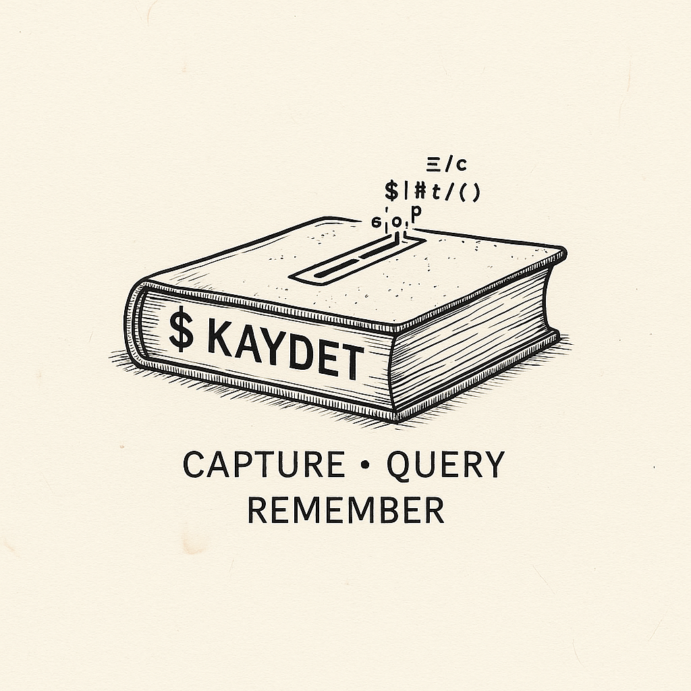

# Kaydet — Capture • Query • Remember

<div align="center">
  
  <br><br>
</div>

[](https://pypi.org/project/kaydet/)
[](https://pypi.org/project/kaydet/)
[](https://pypi.org/project/kaydet/)
[](LICENSE)

> The stand-up ends. You have twelve seconds before the next tab steals your attention.
> `kaydet "Filed the prod incident and fixed cache TTL #work"`.
> Thought captured. Flow preserved.

Kaydet is your queryable personal database—with zero friction.
Not a diary you read, but a database you query.
Capture thoughts, track work, log life—all from your terminal, in plain text.

**[📥 Install Now](#step-into-kaydet)** • **[⚡ Quick Start](#the-daily-toolkit)** • **[🤖 AI Companions](#ai-companions-listen-in)**

## Demo

Watch Kaydet in motion:

<a href="https://asciinema.org/a/Rlcc9GaTQEEfTlUIicvHxm8iC" target="_blank"></a>

## Step Into Kaydet

A blank terminal, a passing thought, a single command. That’s all Kaydet asks.

### Choose Your Arrival

```bash
# Direct from GitHub, latest cut
pip install git+https://github.com/miratcan/kaydet.git
```

```bash
# Prefer isolated tools?
pipx install git+https://github.com/miratcan/kaydet.git
```

```bash
# Want Model Context Protocol access for your AI copilots?
pip install "git+https://github.com/miratcan/kaydet.git#egg=kaydet[mcp]"
```

## Why Kaydet Feels Different

### When Notion Feels Heavy
- You stay in your shell. No app windows, no cursor detours—just a command.
- Entries land in plain text files you can grep, version, or sync however you like.

### When Plain Text Feels Lonely
- Kaydet extracts tags, metadata, and words on each save, stitching them into a SQLite index.
- Search is instant, nuanced, and forgiving: `kaydet --search "status:done project:kaydet"`.

### When Journaling Apps Feel Nosy
- Your data lives on your disk. No telemetry, no mystery servers.
- You pick the editor: `vim`, `nvim`, `nano`, `code`, or anything else you alias.

### When You Want an AI Wingmate
- Built-in MCP server exposes your archive to Claude and friends.
- JSON output turns every entry into structured data for scripts and assistants.

## Scenes From The Terminal

Kaydet chronicles every role you play. Here are a few cameos.

### 💼 Leyla's Work Log
She keeps shipping, keeps receipts.

```bash
kaydet "Fixed staging authentication bug #work commit:38edf60 pr:76 status:done time:2h"
kaydet "Reviewed onboarding flow copy #kaydet status:wip project:kaydet"

# Later
kaydet --search commit:38edf60
kaydet --search "status:done project:kaydet"
```

### 📚 Umut's TIL Notebook
Always learning, always searchable.

```bash
kaydet "TIL: pytest --cov-report=html generates a browsable coverage report #til topic:testing stack:python"
kaydet --search "topic:testing"
```

### ⏱️ Defne's Focus Ledger
She times every deep work block and lets the data guide her week.

```bash
kaydet "Deep work on analytics ETL #focus time:2.5h intensity:high project:valocom"
kaydet "Pairing session with Emre #pair time:1.5h intensity:medium project:kaydet"

# Find the long hauls
kaydet --search "time:>2"
```

### 💡 Efe's Idea Garden
Sparks filed for a calmer tomorrow.

```bash
kaydet "Prototype encrypted export flow #idea area:security priority:high"
kaydet "Read Stripe's migration playbook #research area:payments source:stripe-docs"

kaydet --search "area:security"
```

### 😊 Duru's Mood Journal
Feelings with context, ready for reflection.

```bash
kaydet "Morning run felt amazing #wellness mood:energized sleep:7h"
kaydet "Afternoon slump before standup #mood mood:tired caffeine:2cups"

kaydet --search "mood:energized"
```

### 💰 Selim's Expense Whisperer
Receipts recorded the second they appear.

```bash
kaydet "Lunch with client #expense amount:650 currency:TRY client:bbrain billable:yes"
kaydet "Domain renewal #expense amount:120 currency:USD project:kaydet billable:no"

kaydet --search "billable:yes"
```

## Highlights At A Glance
- **Terminal native** – summon Kaydet with a keystroke, honour your `$EDITOR`.
- **Plain text forever** – durable, syncable, versionable daily files.
- **Smart structure** – automatic tags, metadata, and numeric parsing feed rich search.
- **Gentle cues** – optional reminders nudge you if hours pass without writing.
- **Portable** – runs anywhere Python 3.8+ lives.

## The Daily Toolkit

```bash
# Append a quick thought to today
kaydet "Made progress on the side project #coding time:3h"

# Weave hashtags and metadata into one string
kaydet "Dinner with friends #family #gratitude mood:happy"

# Linger in your preferred editor
kaydet --editor

# Jump straight to the archive folder
kaydet --folder

# Housekeeping
kaydet --tags             # list tags with counts
kaydet --doctor           # rebuild the index if files changed on disk
kaydet --browse           # open the optional Textual browser

# Hunt through the archive
kaydet --search gratitude
kaydet --search "status:done"
kaydet --search "time:>1"

# Revise or retire past entries by ID (IDs surface in search output)
kaydet --edit 42
kaydet --delete 42 --yes   # skip confirmation prompts
```

> Install the optional browsing UI with `pip install "kaydet[browse]"`.

### How Stats Feel

```
September 2025
Mo Tu We Th Fr Sa Su
 1[  ]  2[  ]  3[  ]  4[  ]  5[  ]  6[  ]  7[  ]
 8[  ]  9[  ] 10[  ] 11[  ] 12[  ] 13[  ] 14[  ]
...
Total entries this month: 12
```

### How Entries Are Written

```
14:25 [132]: Finished refactoring the sync helper #focus
```

Each note lives in a dated file (for example `~/.kaydet/2024-02-19.txt`). Kaydet updates the file, refreshes the SQLite index, and keeps IDs stable—even if you circle back to edit or delete.

Inline hashtags (`#family`) and metadata (`project:valocom`, `time:45m`) travel together. Search can pivot on either style without extra effort.

## Configure Kaydet To Your Taste

Kaydet writes its settings to `~/.config/kaydet/config.ini` (or the path defined by `XDG_CONFIG_HOME`). First run creates the file; after that, it’s yours to edit.

```ini
[SETTINGS]
DAY_FILE_PATTERN = %Y-%m-%d.txt
DAY_TITLE_PATTERN = %Y/%m/%d - %A
LOG_DIR = /Users/you/.kaydet
EDITOR = nvim +'startinsert'
REMIND_AFTER_HOURS = 4
```

### Field Notes
- Override the editor anytime with `kaydet --editor`.
- Anything shaped like `key:value` becomes queryable metadata (`kaydet --search "status:done"`).
- Durations like `2h`, `90m`, or `3.5` become numerics (`kaydet --search "time:>2"`).
- Inline and explicit tags merge into one tidy index (`kaydet --tags`).
- Manual file edits? Run `kaydet --doctor` to repair IDs and refresh search tables.

## AI Companions Listen In

Launch `kaydet-mcp` and let your assistants query your personal database. Tools now include:

- `add_entry` – structured JSON response with entry ID, path, timestamp
- `update_entry`, `delete_entry` – edit without spawning an editor or confirm a delete automatically
- `search_entries`, `list_recent_entries`, `entries_by_tag`
- `list_tags`, `get_stats` (with optional `year`/`month` parameters)

### Sample Dialogues

#### 🔎 Sprint Retro in Seconds
```
You: "What did I ship last sprint?"

AI: *scans #work entries*
"Sprint summary:
- Shipped analytics batching (commit 38edf60)
- Updated onboarding copy (status:done)
- Investigated auth regression (status:wip)"
```

#### 📚 Learning Ledger
```
You: "Remind me what I studied about testing last month."

AI: *filters topic:testing*
"Highlights:
- Pytest coverage flags and HTML export (Sept 3)
- Property-based testing with Hypothesis (Sept 11)"
```

#### 💪 Fitness Pulse
```
You: "Am I exercising more this month than last month?"

AI: *counts #fitness entries*
"This month: 18 entries (avg 4.5/week)
Last month: 12 entries (avg 3/week)
You're up 50%. Most frequent activity: running (8 entries)."
```

#### 🎯 Productivity Patterns
```
You: "What patterns do you see in my work habits?"

AI: *maps tags and timestamps*
"Observations:
- Peak focus: 09:00–11:00
- Deep work appears most on Tuesdays/Thursdays
- Bug fixes cluster after lunch
- Breaks happen more when tasks are tagged #frontend"
```

#### 💼 Meeting Follow-ups
```
You: "What action items came out of meetings with the design team?"

AI: *finds #meeting #design*
"Six meetings logged. Open items:
- Finalize dashboard palette (Sept 5)
- Review mobile mockups (Sept 12)
- Collect navigation feedback (Sept 19)
- Schedule user testing (Sept 26 — pending)"
```

#### 🤝 Personal CRM
```
You: "When did I last sync with John from Marketing?"

AI: *searches for 'John' and #marketing*
"September 20:
'Quick sync with John from Marketing about Q4 campaign. He'll send the brief by Friday. Follow up next week. #marketing #john'"
```

#### 💡 Feature-Finding
```
You: "Show every Kaydet feature idea I've logged."

AI: *queries #kaydet #idea*
"Eight ideas spotted:
- Add data encryption (Sept 2)
- Export to PDF (Sept 10)
- Mobile companion app (Sept 15)
- Voice-to-text entry (Sept 18)
..."
```

#### ✍️ Hands-Free Capture
```
You: "Add entry: Finished the dashboard redesign.
Took longer than expected due to responsive layout issues.
Happy with the result. #work #frontend #design"

AI: ✅ Logged at 14:32
```

### Simple Prompts Still Work
- "Add an entry: Today I fixed the auth bug #work"
- "Search my logs for 'Apollo project'"
- "What are my stats for this month?"
- “List all my tags”
- “Show #fitness entries from last week”

### JSON For Everything

```bash
kaydet --search work --format json
kaydet --tags --format json
kaydet --stats --format json
```

## Development

Want to tinker under the hood? Clone and run Kaydet from source:

```bash
git clone https://github.com/miratcan/kaydet.git
cd kaydet
pip install -e .

# Optional tooling
pip install -e .[dev]
ruff check src
black --check src
```

Launch the CLI locally with `python -m kaydet`.

## Contributing

Bug reports, feature ideas, and pull requests are all welcome.  
Raise an issue, open a PR, or share how you use Kaydet—we build faster together.

## License

Kaydet ships under the permissive [MIT License](LICENSE).  
Release notes live in [CHANGELOG.md](CHANGELOG.md).

---

<div align="center">

💡 **Found Kaydet useful?**

[⭐ Star the repo](https://github.com/miratcan/kaydet) so more people discover it.

Written with Concerta by [Mirat Can Bayrak](https://github.com/miratcan)

</div>
