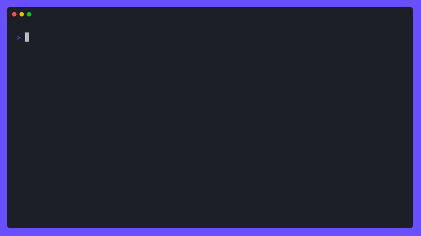

# Never lose a solution twice.

Kaydet (pronounced "kai-det", Turkish for "record") is a terminal note-taking application for developers. Capture work logs, ideas, daily notes, and structured metadata in plain text. Instantly search everything with SQLite FTS, and let your AI search your history too.

[](https://github.com/miratcan/kaydet/actions)
[](https://github.com/miratcan/kaydet/actions/workflows/test.yml)
[](LICENSE)
[](https://www.python.org/downloads/)
[](https://github.com/miratcan/kaydet/stargazers)

<p align="center">
  
</p>

## Install

```bash
pipx install kaydet
```

With AI (MCP) support:

```bash
pipx install kaydet[mcp]
```

**Also available via:**

```bash
uv tool install kaydet    # uv
```

## Quick Start

```bash
# Capture a solution (terminal notes, instantly)
kaydet "Fixed auth race condition commit:abc123 issue:312"

# 6 months later — find it
kaydet --filter auth

# Log what you worked on (work log / developer diary)
kaydet "Deep work on ETL pipeline #work time:3h focus:high"

# Todo from the command line (CLI notes + tasks)
kaydet --todo "Write unit tests priority:high"
kaydet --done 42

# Search by metadata
kaydet --filter "status:done"
kaydet --filter "time:>2"

# Open today's entry in your editor
kaydet --today

# See your stats (plain text notes, searchable)
kaydet --stats
```

## AI Integration

Powered by MCP (Model Context Protocol). Connect Claude Desktop, Cursor, or any MCP-compatible tool:

```json
// claude_desktop_config.json
{
  "mcpServers": {
    "kaydet": {
      "command": "kaydet-mcp"
    }
  }
}
```

Then ask your AI:

- "What did I work on this week?"
- "How did I fix that auth bug last year?"
- "Summarize my accomplishments from last sprint"
- "What expenses did I log in March?"

Your AI grounded in your own data. Not generic knowledge — your knowledge.

### MCP Tools

Built-in MCP server with tools for search, metadata filtering, todo management, stats, summarization, and more.

### Architecture

```
┌─────────────────────┐
│   Claude Desktop    │
│  or any MCP client  │
└────────┬────────────┘
         │ MCP protocol
┌────────▼────────────┐
│     kaydet-mcp      │
└────────┬────────────┘
         │
     ┌───┴───┐
┌────▼───┐ ┌─▼────────────┐
│ daily  │ │ SQLite index │
│ .txt   │ │ (FTS5 full-  │
│ files  │ │  text search)│
└────┬───┘ └──────────────┘
     │
     ▼
Google Drive / iCloud / Dropbox
```

## Why Kaydet?

**Never lose a solution twice.** How many times have you fixed a bug, then six months later faced the same problem with no memory of how you solved it? Kaydet is your external memory — a **searchable notes** database that lives in your terminal.

**Zero friction.** One command from your terminal. No app windows, no context switching, no loading screens. The fastest **CLI notes** workflow you'll find.

**Plain text ownership.** Daily `.txt` files you can grep, version with git, sync however you like. Your data outlives any app. True **plain text notes** with no lock-in.

**Queryable database.** SQLite FTS5 index with full-text search, structured metadata (`time:>2`, `status:done`), and numeric comparisons. Real **SQLite FTS** search across thousands of entries.

**AI-native.** Your AI can read and write your notes. It's not a chatbot with generic knowledge — it's an AI that knows your work history. Built from day one with AI integration.

## How Kaydet Compares

### vs CLI Tools

| | kaydet | jrnl | nb | Toney |
|---|---|---|---|---|
| **Terminal notes** | ✅ | ✅ | ✅ | ✅ |
| **Developer diary** | ✅ | ❌ notebook | ❌ notebook | ❌ |
| **Work log** | ✅ daily files | ❌ | ❌ | ❌ |
| **SQLite FTS search** | ✅ FTS5 | ❌ | ❌ grep | ❌ |
| **Structured metadata** | ✅ `time:>2` | ❌ | ❌ | ❌ |
| **AI/MCP server** | ✅ | ❌ | ❌ | ❌ |
| **Plain text files** | ✅ | ✅ | ✅ | ❌ |
| **Todo management** | ✅ | ❌ | ✅ | ❌ |
| **Edit/delete by ID** | ✅ | ❌ | ❌ | ❌ |
| **Git sync** | ✅ `--init --sync` | ❌ | ✅ (automatic) | ❌ |
| **Language** | Python | Python | Shell | Go |

### vs Knowledge Apps

| | kaydet | Obsidian | Notion |
|---|---|---|---|
| **Terminal-native** | ✅ | ❌ | ❌ |
| **Offline first** | ✅ | ✅ | ❌ |
| **Plain text** | ✅ | ✅ | ❌ |
| **Git-friendly** | ✅ | ❌ | ❌ |
| **AI access (MCP)** | ✅ | partial | partial |
| **Structured metadata queries** | ✅ | ❌ | ❌ |
| **Zero friction capture** | ✅ | ❌ | ❌ |

## Features

- **Todo management:** Built-in task tracking with `--todo` and `--done`
- **Structured metadata:** `key:value` syntax with numeric comparisons (`time:>2`, `status:done`, `priority:high`)
- **Smart tagging:** Hashtags (`#work`, `#bug`) and metadata in one natural string
- **Edit/delete by ID:** Stable numeric identifiers for every entry
- **File attachments:** Attach files with `--attach` or move with `--grab`
- **Plain text storage:** Human-readable `.txt` files, one per day
- **SQLite FTS5 indexing:** Fast full-text search across thousands of entries
- **Git sync:** Built-in `--init`, `--sync`, and `--status` commands
- **MCP integration:** Connect Claude Desktop, Cursor, and any MCP-compatible AI

## Usage

### Basic Commands

```bash
# Add an entry
kaydet "Morning standup went well #work"

# Add with metadata
kaydet "Deep work session #focus time:3h intensity:high project:kaydet"

# Attach files
kaydet "Meeting notes" --attach notes.pdf
kaydet "Screenshot" --grab screen.png        # copies + removes original

# Search & Filter
kaydet --filter "#work"
kaydet --filter "project:kaydet status:done"
kaydet --filter "time:>2"
kaydet --list                                # list today's entries
kaydet --today                               # open today's file in editor
kaydet --get 42                              # show entry by ID

# Todo Management
kaydet --todo "Write unit tests priority:high"
kaydet --done 42                             # Mark todo as done
kaydet --todo                                # List pending todos

# View
kaydet --tags                                # List all tags with counts
kaydet --stats                               # Show calendar and stats
kaydet --folder                              # Open log directory
kaydet --format json --filter "#work"        # JSON output

# Edit & Delete
kaydet --edit 42                             # Open in editor
kaydet --edit 42 "Updated message"           # Inline update
kaydet --delete 42                           # Delete by ID
kaydet --delete 42 --yes                     # Skip confirmation

# Sync (Git)
kaydet --init "https://github.com/you/notes.git"  # Init repo + set remote
kaydet --sync                                      # Commit + push + pull
kaydet --status                                    # Show working tree status

# Management
kaydet --doctor                              # Rebuild search index
kaydet --config                              # Edit config file
kaydet --reminder                            # Show writing reminder
kaydet --at "2024-01-15:14:30" "Note"       # Backdated entry

# Version
kaydet --version
```

> Need a literal `#` in your note? Escape it as `\#` (e.g.,
> `kaydet "Budget was \#1"`).

### Entry Format

Entries are stored as plain text with this format:

```
14:25 [42]: Fixed auth bug commit:abc123 time:2h status:done #work #urgent
```

- Timestamp and unique ID
- Message
- Metadata (`key:value` pairs)
- Tags (hashtags)

### File Structure

```
~/Documents/Kaydet/          → Synced (storage)
├── 2025-10-26.txt
├── 2025-10-27.txt
├── 2025-10-28.txt
└── ...

~/.local/share/kaydet/       → Local only (index)
  └── index.db
```

### Metadata Queries

Kaydet parses `key:value` pairs and supports:

- **Exact match:** `status:done`, `project:kaydet`
- **Numeric comparison:** `time:>2`, `time:>=1.5`, `time:<5`
- **Ranges:** `time:1..3` (between 1 and 3 hours)
- **Duration parsing:** `2h` → `2.0`, `90m` → `1.5`, `2.5h` → `2.5`

### Configuration

Settings are in `~/.config/kaydet/config.ini`:

```ini
[SETTINGS]
DAY_FILE_PATTERN = %Y-%m-%d.txt
DAY_TITLE_PATTERN = %Y/%m/%d - %A
STORAGE_DIR = ~/Documents/Kaydet
EDITOR = nvim
REMIND_AFTER_HOURS = 4
COLOR_HEADER = bold cyan
COLOR_TAG = bold magenta
COLOR_DATE = green
COLOR_ID = yellow
```

If `STORAGE_DIR` is omitted, Kaydet picks a sensible default on first run:
- macOS / Windows → `~/Documents/Kaydet`
- Linux → `~/Kaydet`

Prefer hidden/XDG dirs? Change `STORAGE_DIR` (e.g., `~/.local/share/kaydet`) in
`config.ini` and rerun `kaydet --config`; the CLI offers to move files for you.

### Color Customization

You can customize output colors by adding these to `[SETTINGS]` in `config.ini`:

```ini
COLOR_HEADER = bold cyan
COLOR_TAG = bold magenta
COLOR_DATE = green
COLOR_ID = yellow
```

Any [Rich color string](https://rich.readthedocs.io/en/stable/style.html#color-names) works (e.g., `red`, `bold green`, `rgb(255,100,0)`).

## Use Cases

**Work Logging / Developer Diary**
```bash
kaydet "Shipped analytics feature #work commit:a3f89d pr:142 status:done time:4h"
kaydet "Investigating prod timeout #oncall status:wip time:1.5h"
```

**Debug History (never lose a solution twice)**
```bash
kaydet "Auth race condition fixed — was missing mutex on token refresh commit:abc123"
```

**Time Tracking**
```bash
kaydet "Deep work on ETL pipeline #work time:3h focus:high"
kaydet --filter "time:>2"  # Find long sessions
```

**Personal Journaling**
```bash
kaydet "Morning run felt amazing #fitness time:30m distance:5k"
kaydet "Read Atomic Habits chapter 3 #reading"
```

**Expense Tracking**
```bash
kaydet "Lunch with client #expense amount:850 currency:TRY billable:yes"
kaydet --filter "billable:yes"  # Generate invoice data
```

## Sync

Kaydet separates storage (plain text files) from index (SQLite database). Only the plain text files are synced — each device builds its own search index locally. Minimal sync conflicts, no infrastructure cost.

### Git Sync (Built-in)

```bash
kaydet --init "https://github.com/you/notes.git"   # one-time setup
kaydet --sync                                        # commit + push + pull
```

Runs git in your storage directory. Your diary files, attachments, and metadata are all versioned.

### Cloud Folder Sync

Works with Google Drive, iCloud, Dropbox, Syncthing, or any folder sync tool. Just point `STORAGE_DIR` to your synced folder.

See [docs/sync.md](docs/sync.md) for details.

## Development

```bash
git clone https://github.com/miratcan/kaydet.git
cd kaydet
pip install -e .[dev]
pytest
ruff check src
```

## Contributing

Bug reports, feature ideas, and pull requests welcome. See [docs/CONTRIBUTING.md](docs/CONTRIBUTING.md) for guidelines.

## License

MIT License. See [LICENSE](LICENSE) for details.

## Links

- [GitHub Repository](https://github.com/miratcan/kaydet)
- [docs/AGENTS.md](docs/AGENTS.md) — agents must read this before interacting with the repo

## Star History

<a href="https://www.star-history.com/?repos=miratcan%2Fkaydet&type=date&legend=top-left">
 <picture>
   <source media="(prefers-color-scheme: dark)" srcset="https://api.star-history.com/chart?repos=miratcan/kaydet&type=date&theme=dark&legend=top-left" />
   <source media="(prefers-color-scheme: light)" srcset="https://api.star-history.com/chart?repos=miratcan/kaydet&type=date&legend=top-left" />
   
 </picture>
</a>

---

<div align="center">

Built by [Mirat Can Bayrak](https://github.com/miratcan)

</div>
