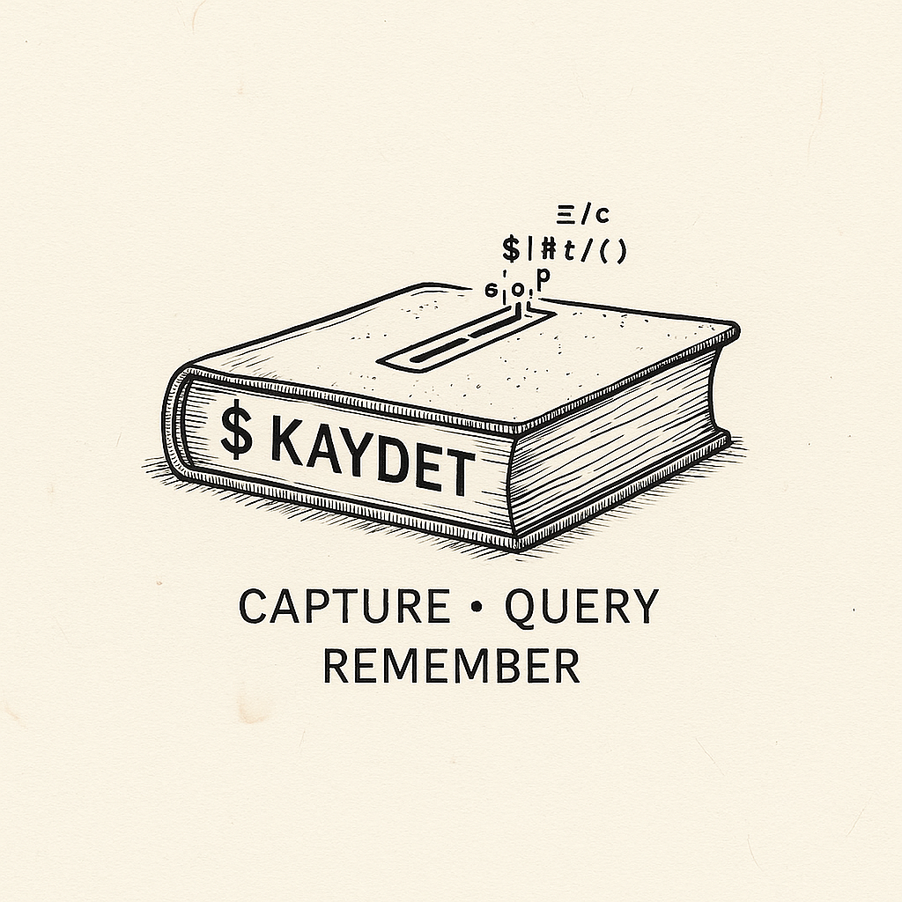

# Kaydet — Capture • Query • Remember

<div align="center">
  
  <p><i>The memory engine for those who live in the terminal.</i></p>
</div>

[](https://github.com/miratcan/kaydet/actions)
[](https://github.com/miratcan/kaydet/actions/workflows/test.yml)
[](LICENSE)
[](https://www.python.org/downloads/)

> Kaydet is not a diary you read—it's a database you query.

**Your brain is leaky. Kaydet is not.** Capture work logs, personal milestones, expenses, or fleeting thoughts in pure plain text. Then, query them like a pro using SQLite-powered search and AI.

---

## Why Kaydet?

**Zero Friction Capture**
One command. No windows, no loading screens, no context switching. If you can type `git commit`, you can use `kaydet`.

**Plain Text is Forever**
Tools die. Companies close. Plain text files stay. Kaydet stores everything in human-readable `.txt` files. You own your data, forever.

**Queryable Memory**
Don't just scroll back. Search your life with numeric filters: `time:>2h`, `status:done`, or `amount:<500`.

**AI-Powered Reflection**
With built-in MCP support, your AI assistant (like Claude) can read your logs. Ask it: *"How much time did I spend on project X last month?"* or *"Summarize my mood patterns this week."*

---

## The Weekend Problem (Solved)

We love the terminal, but life happens. When you're away from your keyboard on weekends, Kaydet follows you.

- **Sync Anywhere:** Use the built-in sync server to keep your home office and laptop in perfect harmony. Use the HTTP transport to capture thoughts remotely and have them waiting in your terminal archive when you're back.

---

## Quick Start

```bash
# Capture a thought
kaydet "Shipped auth feature #work time:3h status:done"

# Add a todo
kaydet --todo "Review PR #42 priority:high"

# Attach a receipt or photo
kaydet "Lunch with client #expense amount:120" --attach receipt.jpg
```

### Search Like a Pro

```bash
# Find all completed work sessions longer than 2 hours
kaydet --filter "#work status:done time:>2"

# Filter by date
kaydet --filter "since:2026-04-01 until:2026-04-30"

# List all tags and counts
kaydet --tags
```

---

## AI Integration (Model Context Protocol)

Connect Kaydet to Claude Desktop and talk to your data:

```json
// claude_desktop_config.json
{
  "mcpServers": {
    "kaydet": { "command": "kaydet-mcp" }
  }
}
```

**Try asking Claude:**
- *"What did I accomplish during the last sprint?"*
- *"Based on my logs, when am I most productive?"*
- *"Remind me what I discussed with Ali about the sync protocol."*

---

## Sync & Ownership

Kaydet separates **storage** (plain text) from **indexing** (SQLite). This means:
1. **Source of Truth:** Your `.txt` files are always the master copy.
2. **Local First:** Everything works offline.
3. **Encrypted Secrets:** Use `--secret` to store sensitive info (like passwords) as encrypted blobs that even the sync server can't read.

---

## Install

```bash
pip install git+https://github.com/miratcan/kaydet.git
```

For AI support:
```bash
pip install "git+https://github.com/miratcan/kaydet.git#egg=kaydet[mcp]"
```

---

<div align="center">
  <p>Built with 🖤 by <a href="https://github.com/miratcan">Mirat Can Bayrak</a></p>
  <p><i>Plain text is not just a format, it's a commitment to your future self.</i></p>
</div>
